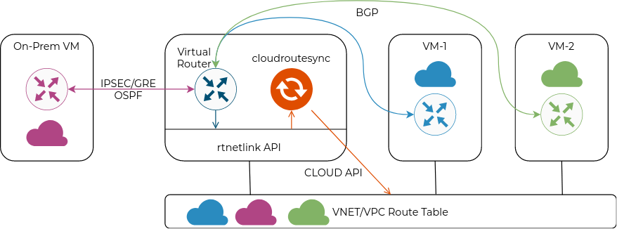

# CloudRouterSync
An add-on for cloud-hosted routers that periodically reads local routes via [rtnetlink](https://man7.org/linux/man-pages/man7/rtnetlink.7.html) and synchronizes them with a cloud routing table.



The main use cases are:

* Self-managed Kuberentes clusters with BGP-based reachability (e.g. KubeRouter, Calico)
* Multi/Hybrid cloud -- sync local route table with subnets configured in a different environment.

> Note: The application relies on another routing daemon to program local netlink routes. This can be [FRR](http://docs.frrouting.org/en/latest/), [Quagga](https://www.nongnu.org/quagga/docs/quagga.html), [Bird](https://bird.network.cz/) or any other routing software suite.

## Currently Supported Clouds

* Azure
* AWS (coming soon)


## Prerequisites

The application must be running on a cloud VM with enough IAM permissions to create/update cloud route table.

For example, on Azure this would require:

* Enabled system identity
* Assigned "Network Contributor" role

See Terraform [directory](./terraform) for more examples.

## Installation

To build a binary:

```
go get -v github.com/networkop/cloudroutersync
```

## Usage

```
Usage of ./cloudroutersync:
  -cloud string
    	public cloud providers [azure|aws|gcp]
  -event
    	enable event-based sync (default is periodic, controlled by 'sync')
  -netlink int
    	netlink polling interval in seconds (default 10)
  -sync int
    	cloud routing table sync interval in seconds (default 10)
```

It can run in two modes:

* Event-driven mode - cloud route table is only updated whenever there was a change detected in the netlink routing table

* Periodic mode - cloud route table is synced periodically based on the `-sync` flag.

## Demo

TBD